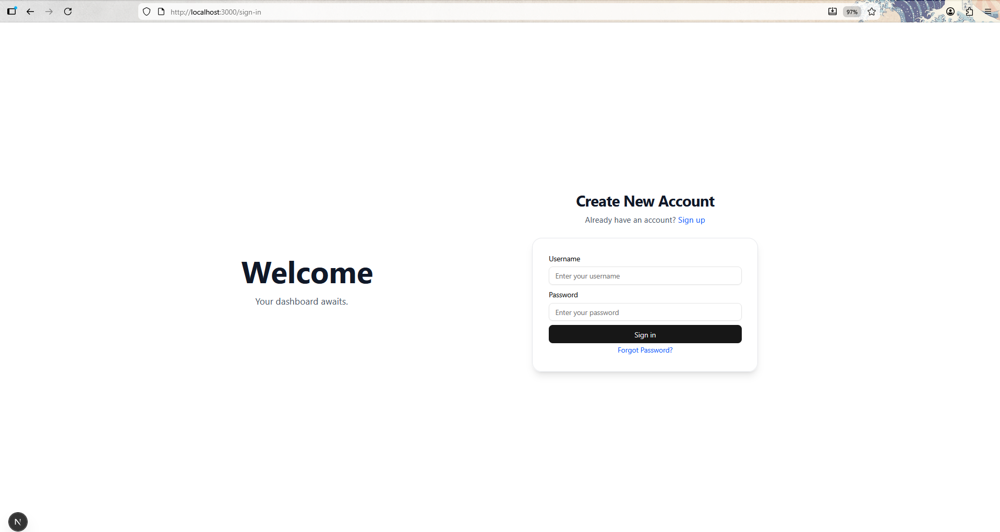
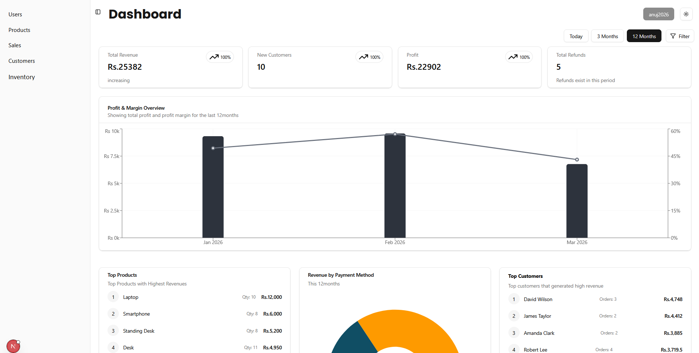
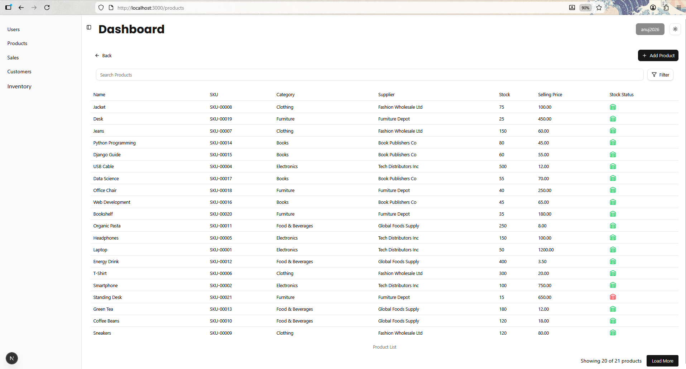
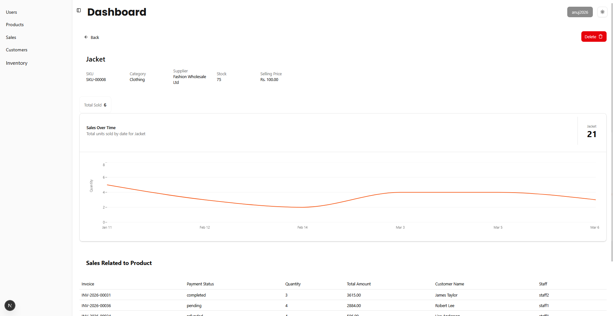
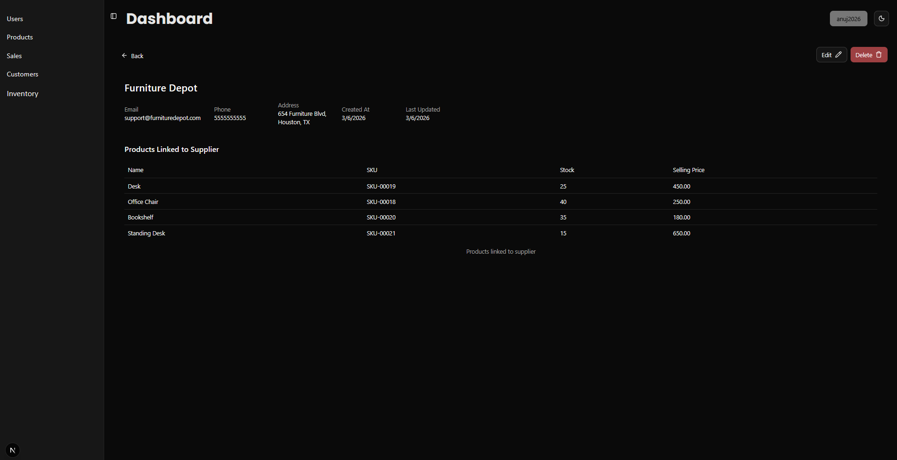

# Inventory & Sales Management — Frontend

A full-featured inventory and sales management dashboard built with **Next.js 15**, **Redux Toolkit**, and **Tailwind CSS**. Connects to a Django REST API backend with JWT cookie-based authentication.

---

## Stack

- **Next.js 15** (App Router)
- **TypeScript**
- **Redux Toolkit** + RTK Query — global state & API calls
- **Tailwind CSS** + **shadcn/ui** — styling & components
- **Recharts** — data visualisation
- **pnpm** — package manager

---

## Features

- **Authentication** — JWT login/logout stored in HttpOnly cookies, protected routes, public route guard, forgot-password with OTP flow
- **Dashboard** — summary cards (revenue, profit, customers, refunds), profit & margin chart, revenue by payment method, top products & customers, period filter (Today / 3 Months / 12 Months)
- **Products** — paginated list with search & filter, product detail page with per-product sales chart
- **Sales** — list, detail, with PDF invoice download
- **Customers** — list & detail with order history
- **Suppliers** — list & detail with linked products
- **Inventory / Stock Movement** — stock log with movement tracking
- **Categories** — category management
- **Users** — user management with role-based access (admin / manager / staff)
- **Dark Mode** — full light/dark theme toggle
- **Infinite Scroll** — lazy-loaded list pages
- **CSV Export** — sales & stock movement reports

---

## Screenshots

### Sign In



### Dashboard



### Products List



### Product Detail



### Suppliers (Dark Mode)



---

## Getting Started

```bash
pnpm install
pnpm dev
```

Open [http://localhost:3000](http://localhost:3000) in your browser.

> Make sure the Django backend is running on `http://localhost:8000` before starting the frontend.

---

## Project Structure

```
app/              # Next.js App Router pages
components/       # Feature and UI components
config/           # Form control definitions
hooks/            # Custom React hooks (data fetching, auth, scroll)
providers/        # Redux, sidebar, and theme providers
store/            # Redux store + RTK Query API slices
types/            # TypeScript interfaces
utils/            # URL builders and param parsers
validation/       # Client-side param validation
```

---

## Environment

The API base URL is set in `store/auth-slice/index.ts` and the individual RTK Query slices. Point them to your backend:

```
http://localhost:8000
```
